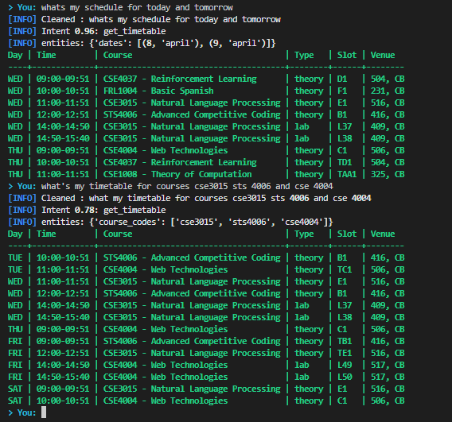
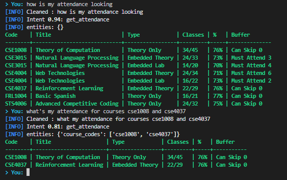

# IntentOS 🚀

An NLP-powered framework that performs intent detection and maps user inputs to appropriate execution layers, enabling automation of real world workflows.

---

## ✨ Features

- 🧠 Intent classification (e.g., timetable, attendance, etc.)
- 🔍 Entity extraction (dates, course codes, percentages, etc.)
- ⚡ Clean modular backend architecture
- 🧩 Easily extendable for new intents and entities
- 🔗 Designed to integrate with APIs (like VTOP)

---

## 📸 Screenshots

<p align="center">




</p>

---

## 🏗️ Project Structure

    src/
    ├── nlp/
    │   ├── intent_classifier.py
    │   ├── entity_extractor.py
    ├── services/
    │   ├── attendance.py
    │   ├── timetable.py
    ├── utils/
    │   ├── formatter.py
    └── main.py

---

## ⚙️ How It Works

1.  User sends a natural language query\
2.  Intent classifier determines the action\
3.  Entity extractor pulls structured data\
4.  Service layer processes request\
5.  Response is returned

---

## 🚀 Getting Started

```bash
git clone https://github.com/sathwikv2005/Intent-OS
cd intentos
python -m venv .venv
source .venv/bin/activate
pip install -r requirements.txt
cd src
python main.py
```

---

## 📄 License

MIT License
